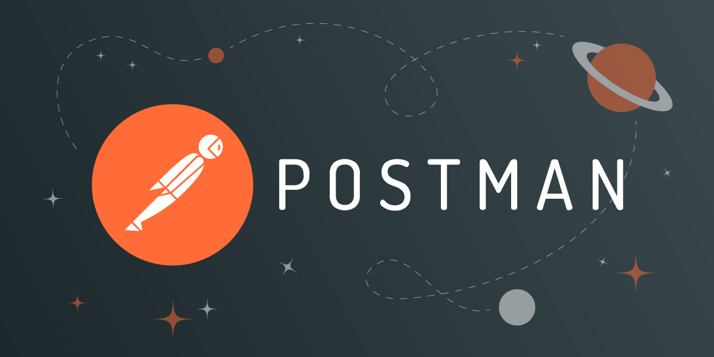

# Hello, folks! 
I’m Himanshu Gupta, an experienced software engineer who specializes in web development. I make it my mission to translate user-focused designs into pixel-perfect websites or applications that run blazing fast.

Want to know more about me? [Check out my portfolio](https://himanshu0809.github.io/my-portfolio/).

 

---

### **Talking about Personal Stuffs:**

- 🚀 &nbsp; I’m currently working as Software Development Engineer at Postman. 
  
I am working on Postman API's Documentation feature which automatically generates consumable API documentation that users can share between themselves and publicly.
  
I am also working on serving API Docs publicly over custom domains by maintaining ACME generated certificates for the domains.
  
**Tech Stack:** React, Javascript, Typescript, ElectronJS, StencilJS, Puppeteer, NodeJS, SailsJS, MySQL, AWS

- 👾 &nbsp; Fun Fact: Equal is Not Always Equal in Javascript
- :eye: &nbsp; Hidden Project: [coursekingdom.xyz](https://www.coursekingdom.xyz)
   
### **Languages and Tools:**

  

  
  <code></code>
  <code></code> 
   <code></code> <code></code> 
  <code></code> 
  <code></code>
  <code></code>
  <code></code> 
  <code></code> 
  <code></code> <code></code> <code></code> 
  <code></code>

<code></code>
  <code></code> 
  <code></code>
<code></code>
 <code></code>
  

  

 

### **📈 GitHub Stats**

  
  

**:handshake:  Lets connect! Find me on your web!**

 

### Show some ❤️ by starring and forking some of the repositories!

  

